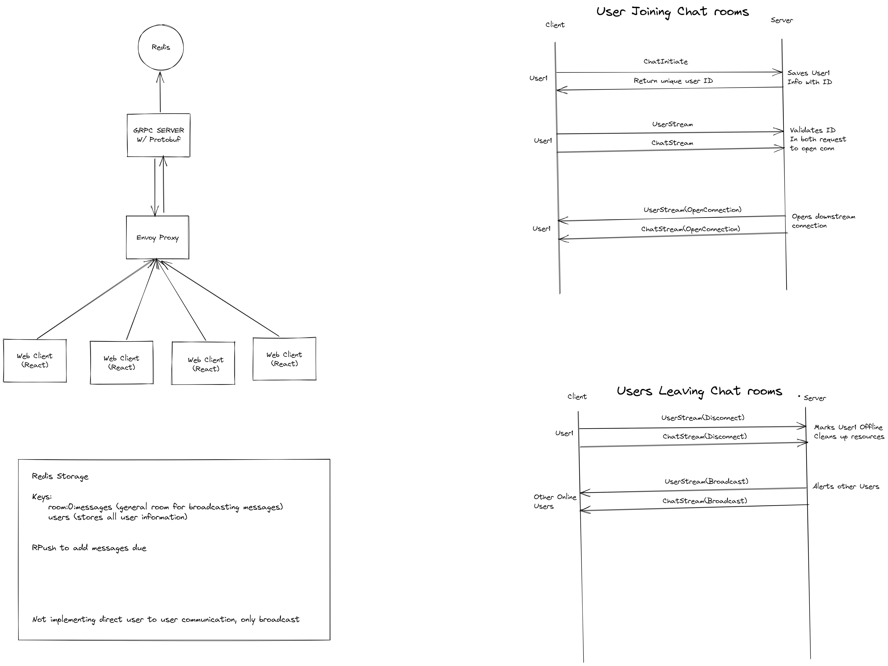

# React gRPC Chat Application

This is an example of a chat application using gRPC, React, Envoy and Redis. Right now this only supports one chat room and implementing direct chat messages is easy but requires some extra work that I am not willing to do right now. If you want to contribute I do not mind!

There is a youtube video series where I go over making this application if intertested [here](https://youtu.be/NFZbTy_B4H0)

## General high level design of this application



## Things you need to run this application

1. Node npm/yarn
2. Docker
3. protoc

## Project setup

```
docker compose up -d
yarn install
yarn proto:gen
yarn start
cd client && yarn install
yarn start
```
